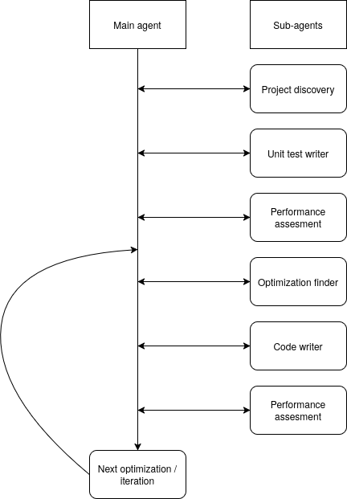

# HPC project

The goal is to build a full pipeline of agents that can work together to optimize
a project. The optimization asked can be really targeted and local or more global
on a whole project.

The biggest bottlenecks in LLMs is memory. Memory is expensive and the LLM remembers
the last n tokens better and tends to forget content which is too old. This is why
we have a lot of sub agent which all have really targeted and specific tasks aiming
to reduce their context windows and token usage.

## Main idea

The main agent serves primarily to write prompts for subagents and link them together.
It's role is to orchestrate the subagents and ensure that the pipeline stays coherent.
It needs to have a mid/low level of intelligence. It only needs to write good prompts
and link the agents together.

It needs to do one optimization at a time. It has a list of all optimization types
and goes through them one by one. It only goes to the next one if the previous performance
assessment is good enough. When this is the case, it commits the code on the current
branch with a message describing: the iteration and optimization type, the performance
before and after, and the files changed.

The optimization loop goes for N iterations. So it should go over each optimization
type N times.

## Skills

- nix: modify a `shell.nix` or `flake.nix` file to add dependencies and run commands inside the nix environment.

## Tools

### lsp

Read the LSP output of a project and specific files to get errors and warnings while
writing code. This allows to get a fast feedback loop which doesn't need to wait
for a full build to get feedback on the code.

### performance benchmark

Run a performance benchmark on the project and get the results to find bottlenecks
and areas of improvement. There are multiple types of performance benchmark which
all call different tools and focus on different aspects of performance. The agent
chooses the right one depending on it's prompt and context.

## Subagents

### Project discovery

Intelligence level: low

Is called once before the start of the loop to discover the project and its structure.
It will focus on the areas of the project which are relevant to the task. It will
read the project structure and some files to get a good understanding of the project.

Then, it will write a report on the project structure and the global data flow and
logic of the different components. This report will be injected in the context of
all the other agents so that they have a good understanding of the project and don't
need to polute their context too much with project discovery.

We also run `nix --version` to know if the nix skill is relevant. This isn't done
by an agent but injected in the report of the project discovery.

### Unit test writer

Intelligence level: mid

Is called once before the start of the loop to write unit tests for the parts of
the project which are relevant to the task. The goal is to ensure that the optimizations
don't change the behavior of the code and that we can easily check if the optimizations
are correct or not. It will read the project structure and some files to understand
the code and write unit tests for the relevant parts. It should focus on writing good
unit tests which cover the relevant parts of the code.

### Optimization finder

Intelligence level: high

It is given an optimization type and is able to run benchmarks and read their results
to identify potential optimizations. It should read files but never write code.
At the end, it writes a report describing in detail the potential optimizations it
found in the given optimization type. This report will be the prompt used by the code
writer agent to write code.

### Code writer

Intelligence level: high

It is given a report on what to optimize and how to optimize it. It should read files
to understand the context and write the implementation. It should focus on keeping
the code size small and keep the code quality good. It uses the lsp tool and build
tools to get a fast feedback loop while writing the code. It should also run the
unit tests as part of the feedback loop to ensure that the optimizations don't break
the code.

### Performace assessor

Intelligence level: mid

It is called once before the loop to run benchmarks and get the performance of the
project before any optimization. Then, it is called after each optimization. Once
the code writer has implemented the optimization, the performance assessor runs
benchmarks again to asess the performance improvement. It should compare the results
with the previous performance and write a report describing the performance improvement.
Actually, it should write two reports: one for the next iteration, and one in json
format which is written to a file so that we can render it in a nice web dashboard.
