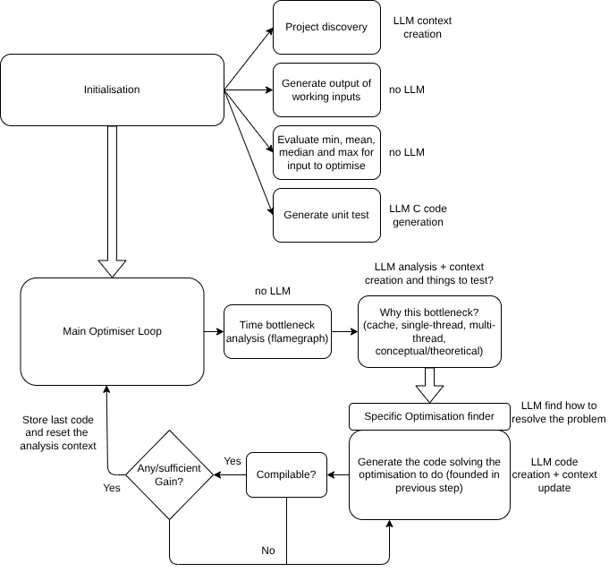

## Tool used

- [Pi website](https://pi.dev/), [Pi github](https://github.com/earendil-works/pi/tree/main)
- Kimi K2.5
- Deepseek

### User inputs

- C code base (more than only 1 file but entire codebase)
- Only 1 input to optimise (1 fixed command line) (input_to_optimise)
- Some/All inputs where the code need to work fine. (inputs_working)
- MaxTime, MaxTokenUse, MaxMoneyUse, MaxNumberOfLoop
- Metric to optimise (per default use min time)

Goal: Minimise time used by an algorithm for a fixed input.

### Initialisation Phase

The goal of this phase is to do multiple things:

1. Project discovery.
2. Create unit test, i.e. assume the code is working perfectly as it is. Create files with all inputs tested and attended result (inputs_working + input_to_optimise). Watch out for the use of random variable. If so, change to setseed for reproduction purpose.
3. Test it's performance on the input to optimise to get the baseline. Only do precise input speed test multiple time (we can look at baseline and do like min_number_of_iteration or else, max_time/one_shot_speed number of time) and track min, mean, median and max time.

We define which metric we want to optimise. Per default, we will use min.

Keep track, for which input (we can do one_shot for working inputs but total analysis for input to optimise), which alogrithm is faster of the metric used and we can create a small c script that does if inputs is between that => use this code

BUT on the loop phase, we will only keep track of the better code for the specific input to optimise.

### Loop phase

The goal of this phase is to describe exactly how the optimisation loop is working.

1. Time bottleneck test (find which part of the code is the bottleneck using flamegraphs (not visually but numericly))
2. Find why the bottleneck exist between finite set of predefined limits:
- Cache
- Single thread instruction density
- Parallelisation
- Theoretical/Model, other algorithm
- Other data-structure

Using predefined tools like cachegrind, etc...

3. Once thats done, call specific agent optimiser (with specific prompt like focusing on cache optimisation) using all function call stack to optimise, which bottleneck exists (the result of previous analysis)

4. Verify if it is compilable, if not, call a llm to make it compilable.

5. Verify using (the context of the llm creating the code shouldn't access the test file using the input working) the inputs that we created in the initialisation step that it output the same output.

We keep track of the best code.

6. We loop on this specific problem with all code tested until we get sufficient  performance boost (simple: if better, break)

### Global Rules to follow

1. Use only CPU.
2. Use C code only.
3. No machine specific optimisation.
4. No assumption on hardcoding/lut and so on! Do no just output the result.
5. Max loop, token, price size for all loop.

 Here is the complete list of useful tools for your HPC optimization pipeline:

---

### Compiler & Build
- **GCC / Clang** — compilation with `-g -O2 -fno-omit-frame-pointer` for profiling; `-O3 -march=native` for final benchmarks; PGO and LTO support
- **Compiler diagnostics extractor** — parses warnings, errors, and vectorization remarks into structured JSON

### Time Benchmarking
- **Hyperfine** — cross-platform benchmarking with statistical analysis and JSON export

### Bottleneck Analysis (Flamegraphs)
- **perf + FlameGraph** — `perf record -F 997 -g` for CPU sampling, `stackcollapse-perf.pl` + `flamegraph.pl` for visualization, `perf report --stdio` for numeric summaries parseable by LLMs
- **perf stat** — quick hardware counter snapshot (cycles, instructions, branches, branch-misses, cache-references, cache-misses) for bottleneck classification

### Cache Analysis
- **Valgrind Cachegrind** — simulates L1/L2/LL cache hierarchy, reports `D1mr`/`D2mr`/`D1mw`/`D2mw` per function and source line
- **perf cache events** — real hardware counters: `L1-dcache-loads/misses`, `L1-icache-loads/misses`, `LLC-loads/misses`, `dTLB-loads/misses`

### Branch Prediction
- **perf branch events** — `branches`, `branch-misses`, `branch-loads`, `branch-load-misses`
- **perf branch stacks** — `perf record -e branch-misses -b` to capture misprediction locations

### Memory / Heap
- **Valgrind Massif** — heap profiler tracking memory usage over time with peak detection
- **perf mem record/report** — memory access pattern and latency analysis

### Parallelization
- **perf sched** — thread scheduling analysis, latency reports
- **Intel VTune / AMD uProf** — advanced parallel performance analysis (if available on target hardware)

### Static Analysis
- **clang-tidy** — performance and portability anti-pattern detection
- **cppcheck** — fast C static analysis

### Binary Analysis
- **objdump** — disassembly inspection (`-d -M intel -S`)
- **nm** — symbol table with sizes (`--print-size --size-sort`)

### Correctness & Testing
- **diff** — output comparison for regression testing
- **Valgrind Memcheck** — memory error detection to catch optimization-introduced bugs

### Reporting & Aggregation
- **Benchmark result parser** — Python script comparing baseline vs. current iteration, calculating improvement %, generating dashboard JSON and commit messages

---

  Here is the maximally portable curated list — every library below works across x86-64, ARM64, and RISC-V with a single build, no `#ifdef` required:

---

### Parallelization
- **OpenMP** — supported by GCC, Clang, MSVC; pragma-based; works on any CPU with threads
- **pthread** — POSIX standard; available on Linux, macOS, BSD; Windows via pthreads-win32 or mingw

### SIMD (Single Portable Binary)
- **Highway** — single binary runs SSE4/AVX2/AVX512/NEON/SVE/SVE2/RISC-V V; auto-detects at runtime
- **SIMD Everywhere** — maps intrinsics across architectures; compile one source for all targets

### Linear Algebra
- **OpenBLAS** — detects CPU at runtime (Intel, AMD, ARM, RISC-V); multi-threaded; no vendor lock-in
- **BLIS** — configurable backends; explicit ARM and RISC-V support; runtime CPU detection

### Memory Allocation
- **jemalloc** — per-thread arenas; reduces lock contention; portable across POSIX + Windows
- **mimalloc** — Microsoft; excellent small-object performance; single build across platforms

### Hashing
- **xxHash** — pure C; no dependencies; identical output on all architectures
- **SipHash** — standard keyed hash; used by Python, Ruby, Rust; endianness-safe

### Randomness
- **PCG** — pure C; better quality and speed than `rand()`; seed-portable across platforms

### Data Structures
- **stb_ds** — single-header C; dynamic arrays and hash maps; no external deps
- **uthash** — single-header hash tables; works on any C89+ compiler

### Sorting
- **qsort_r** — POSIX.1-2008 standard; reentrant; available on Linux, macOS, BSD
- **timsort** — stable sort; handles real-world patterns; pure C implementations exist

### Bit Operations
- **Builtins** — `__builtin_clz`, `__builtin_ctz`, `__builtin_popcount` — GCC/Clang/ICC/MSVC all support these; compile to optimal instructions per target

### I/O
- **mmap** — POSIX standard; large-file I/O without `read()` overhead

### JSON
- **yyjson** — pure C; fast; no SIMD required; builds everywhere

---

**Tier 1 recommendation** (use first): OpenMP, Highway, OpenBLAS, jemalloc, xxHash, stb_ds